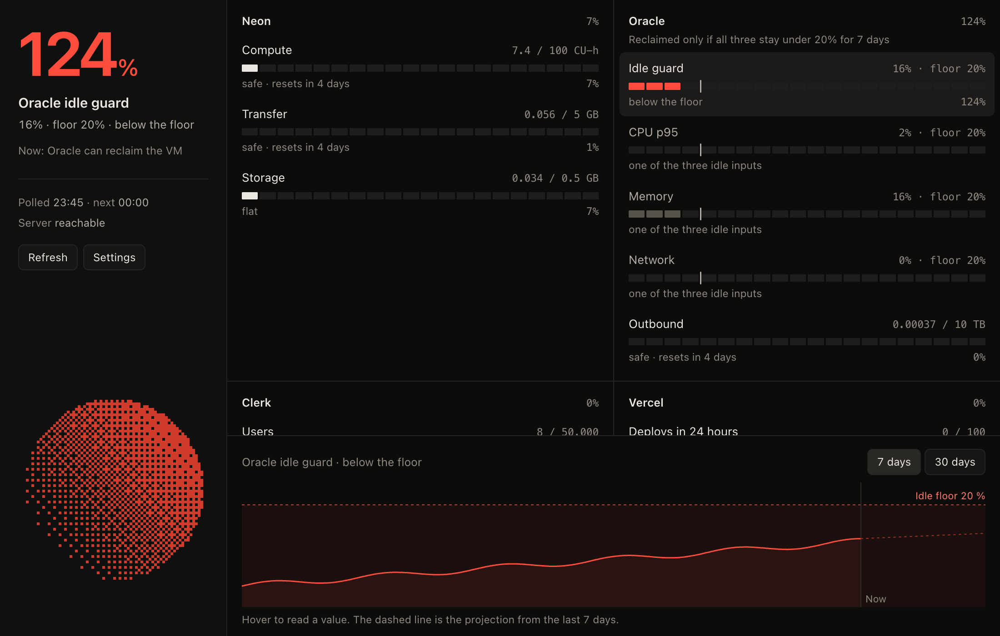
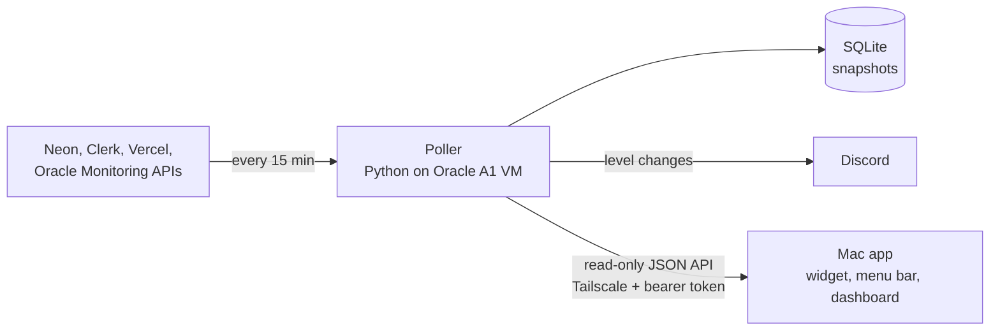

# Burnrate

A self-hosted monitor for free-tier cloud limits. It tracks usage across Neon, Oracle Cloud,
Clerk and Vercel, projects when each limit will be hit, and alerts on Discord before it
happens. It has two parts: a Python service on an Oracle Cloud VM, and a native macOS app
built with Tauri.


<sub>The dashboard with sample data: the Oracle idle guard below its floor, and a 7-day
history with its projection.</sub>

## Why

I run a side project, Fantas.ai, entirely on free tiers. Every provider enforces a
different limit, and missing one breaks something: Neon suspends the database, Vercel
blocks deploys, and Oracle reclaims a VM that stays *idle* for a week. Each dashboard shows
its own numbers, and none of them warn ahead of time. Burnrate puts every limit in one
place, with history and a warning while there is still time to act.

## How it works



- **Poller:** reads each provider's API, saves a snapshot, evaluates levels, sends alerts,
  and serves the API. It runs as a sandboxed systemd service. Provider keys never leave it.
- **Mac app:** a small always-on-top widget showing the worst metric, a menu-bar item, and
  a dashboard with per-metric history charts and projections.

## Engineering highlights

- **Builds its own history.** Most provider APIs report only a current total, so the
  poller stores timestamped snapshots and fits a least-squares slope to project the days
  left before each limit.
- **Alerts that don't spam and don't get lost.** Alerts fire only when a level changes,
  with hysteresis (warn at 80%, clear at 75%). A level is saved only after Discord accepts
  the message, so a failed send is retried next poll and a restart never repeats one.
- **A limit that points down.** Oracle reclaims Always Free VMs whose CPU, memory and
  network all stay under 20% for 7 days. Metrics carry a direction, so the idle guard
  alerts when usage gets too *low*.
- **One failure never stops the loop.** Every call has a hard timeout. Each collector runs
  in isolation, so one provider failing is recorded and alerted on after 4 polls in a row.
  A metric that stops updating is shown as stale, never as current.
- **Security first.**
  - The API listens only on Tailscale, and a Tailscale ACL locks it to one device.
  - Tokens are compared in constant time.
  - The HTTP client refuses redirects, so a token never reaches another host.
  - Oracle access uses instance-principal auth, so no cloud key sits on disk.
  - Secrets are redacted from logs and alerts.
  - The systemd unit runs with `ProtectSystem=strict`, `NoNewPrivileges`, a syscall
    filter and a memory cap.
- **Safe deploys.** `deploy/push.sh` ships only committed code, validates the config and
  checks every collector before swapping releases, and keeps the previous release for
  rollback.
- **Small dependency surface.** The poller is Python standard library only, plus Oracle's
  SDK, with a hash-pinned lockfile audited by `pip-audit`. The app is plain TypeScript with
  no UI framework and hand-drawn SVG charts.
- **Tested.** There are 112 poller tests and 23 app tests, and every commit runs gitleaks
  and a custom staged-secret scanner first.

## Bugs worth writing down

- **The tray menu did nothing.** The widget is a background (accessory) window, so WebKit
  treated it as hidden and suspended its JavaScript. Menu handlers and timers never ran. I
  proved it with a heartbeat probe, and fixed it by turning off background throttling for
  that window.
- **The app blocked its own requests.** Tauri's HTTP allowlist uses URLPattern. It read the
  literal hostname prefix `100.` as an IPv4 number and rewrote it to `0.0.0.100`, so the
  Tailscale pattern matched nothing. I reproduced it against the plugin's own Rust crate,
  switched to a regex group, and added a test that checks the real allowlist file.
- **Then the menu handlers still never ran.** Rust received the menu events but JavaScript
  didn't. In Tauri 2.12, menu items built from plain objects are dropped once the menu is
  built, and dropping them removes their JavaScript channels. Building each item with
  `MenuItem.new` keeps them alive. I found it by reading the framework source.

## Stack

Python 3.14, SQLite (WAL), systemd, Oracle Cloud Monitoring (OCI SDK), Tailscale, Discord
webhooks, Tauri 2, TypeScript, Vite.

## Running it

**Poller** (Python 3.11 or newer):

```bash
cp .env.example .env                              # provider keys, Discord webhook, API token
cp poller/config.example.toml poller/config.toml  # ids, limits, listen address
cd poller
python3 burnrate.py --once          # poll every service once and print; saves nothing
python3 burnrate.py --test-alert    # send one Discord message
python3 burnrate.py                 # run the loop
sh tests/all.sh
```

A service is on when its section is in `config.toml`. The server setup, including the
Tailscale lock-down and the sandboxed unit, is in [deploy/README.md](deploy/README.md).

**Mac app** (Node and Rust):

```bash
cd app
npm install
npm run dev          # the interface in a browser, with sample data
npm run tauri build  # builds Burnrate.app
```

Open the app, then enter the poller's Tailscale address and `BURNRATE_TOKEN`.

Not tracked yet: Gemini per-model requests (Cloud Monitoring has no model label) and Vercel
CPU and bandwidth (Hobby has no usage API).
